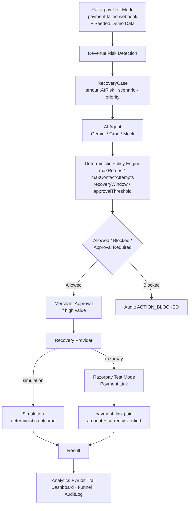

# RecoverAI

**Recover revenue before it's lost.**

RecoverAI is an AI-powered revenue recovery agent that detects revenue at risk, diagnoses payment failures, recommends bounded recovery actions, enforces deterministic merchant policies, executes recovery workflows, and measures recovered revenue.

> **Razorpay AI Buildathon — Track 3 · AI Revenue Recovery** — Built on Razorpay Test Mode.

---

## The Problem

Merchants lose revenue every day to:

- **Failed payments** — card declines, authentication failures, network timeouts.
- **Abandoned checkouts** — customers reach the payment step and leave.
- **Failed subscriptions** — mandate/renewal charges fail on expired or underfunded cards.

Most tooling stops at *detection* — it flags a failure and leaves recovery manual, untracked, and unbounded. RecoverAI turns detection into an **auditable, policy-bounded recovery workflow**.

## The Solution

```
Detect → Diagnose → Recommend → Validate → Approve if needed → Recover → Measure → Audit
```

1. **Detect** — `payment.failed` webhooks and seeded demo data create `RecoveryCase` rows with `amountAtRisk` (paise).
2. **Diagnose** — AI agent (Gemini / Groq / Mock) produces a structured diagnosis + recommended action + confidence + reasoning.
3. **Recommend** — AI returns one of `RETRY_PAYMENT | SCHEDULE_RETRY | SEND_REMINDER | OFFER_ASSISTANCE | ESCALATE_TO_MERCHANT | STOP_RECOVERY`.
4. **Validate** — Deterministic Policy Engine checks every recommendation against hard limits (never bypassed).
5. **Approve if needed** — High-value cases (≥ approval threshold) require explicit merchant Approve/Reject.
6. **Recover** — Recovery Provider executes: `Simulation` (deterministic outcomes) or `Razorpay Test Mode` (real payment link).
7. **Measure** — Dashboard aggregates Revenue at Risk / Recovered / Recovery Rate, funnel, scenario & AI safety metrics.
8. **Audit** — Every decision, policy evaluation, intervention, and webhook is written to `AuditLog`.

## Architecture



**Actual implementation:** Next.js 16 App Router → `src/lib/ai` (provider abstraction) → `src/lib/policy/engine.ts` (deterministic, no LLM in the loop) → `src/lib/recovery/orchestrator.ts` → `src/lib/recovery/providers/{simulation,razorpay}` → `src/lib/razorpay/handler.ts` → `src/lib/analytics/metrics.ts`. All state is `RecoveryCase`/`RecoveryIntervention`/`AIDecision`/`AuditLog` in Neon via Prisma.

## Safety Model

> **AI DOES NOT directly move money.**

| Layer | Role |
|-------|------|
| **AI Agent** | Produces a *recommendation* only (diagnosis + `recommendedAction` + confidence). Never calls a payment API. Validated by Zod (`recoveryAnalysisSchema`). |
| **Policy Engine** (`src/lib/policy/engine.ts`) | Pure function `evaluatePolicy(ctx, config)` — zero AI, zero I/O. Decides `allowed / blocked / approvalRequired` for every action. Single enforcement point used by orchestrator, batch, and AI validation. |
| **Merchant Approval** | Any action on a case where `amountAtRisk ≥ approvalThreshold` and `!merchantApproved` is blocked until `POST /api/recovery/cases/[id]/approve`. Reject → `REJECTED` terminal, no further execution. |
| **Recovery Engine** | `src/lib/recovery/orchestrator.ts` executes only `policy.allowedActions`. Terminal statuses (`RECOVERED | FAILED | STOPPED | REJECTED`) block all further execution. |
| **Audit Trail** | Every case creation, AI decision, policy evaluation, approval/rejection, intervention, and webhook is appended to `AuditLog` — visible at `/audit` and per-case. |

### Current deterministic policy (from `prisma/schema.prisma` + `prisma/seed.ts`)

These are the only values enforced in production — change requires a code/seed change and redeploy:

| Parameter | Value | Meaning |
|-----------|-------|---------|
| **Maximum retries** (`maxRetries`) | **3** | Up to 3 payment retries per case. After that → `STOPPED` or `ESCALATED`. |
| **Maximum contact attempts** (`maxContactAttempts`) | **2** | Up to 2 reminders/assistance messages for checkout abandonment. |
| **Recovery window** (`recoveryWindowHours`) | **72 hours** | Case is only actionable for 72h after detection. After expiry only `STOP_RECOVERY` is allowed. |
| **Approval threshold** (`approvalThreshold`) | **500000 paise = ₹5,000** | Any money-moving action on a case at or above ₹5,000 requires merchant approval. The AI cannot bypass this. |

Window, retry, and approval checks are re-evaluated server-side on every `execute` — the browser never decides.

## Razorpay Test Mode Flow

> **RAZORPAY TEST MODE ONLY.** No live payments are ever attempted.

```
payment.failed
  → POST /api/webhooks/razorpay  (raw body · HMAC-SHA256 via x-razorpay-signature)
  → idempotency (RazorpayWebhookEvent.eventId unique — duplicate deliveries → already_processed)
  → Transaction { status: FAILED, amount, razorpayPaymentId } (upsert)
  → RecoveryCase { scenario: FAILED_PAYMENT, status: DETECTED, amountAtRisk = payment.amount }
  → (no auto-execution, no auto-approval)
  → AI analysis (POST /api/ai/recovery/[id]/analyze)
  → Policy Engine (eligible / approvalRequired)
  → if amountAtRisk ≥ ₹5,000 → merchant Approve required (POST /api/recovery/cases/[id]/approve)
  → Execute RETRY_PAYMENT → Razorpay Payment Link (amount from DB, reference_id = RECOVERAI-{caseId}, expire_by = windowExpiresAt, notes = recoverai_case_id/intervention_id/scenario)
  → RecoveryIntervention { provider: razorpay, status: AWAITING_PAYMENT, paymentLinkUrl } · case → IN_PROGRESS
  → customer completes Test Mode payment at the link
  → payment_link.paid webhook → HMAC + dedup → amount/currency verification (amount === amountAtRisk && currency === INR)
  → if mismatch → RECOVERY_PAYMENT_AMOUNT_MISMATCH, no recovery
  → if valid → Transaction { CAPTURED } · Intervention { SUCCESS, recoveredAmount } · RecoveryCase { RECOVERED } · Audit: RECOVERY_PAYMENT_CONFIRMED + RECOVERY_SUCCESS
  → dashboard Revenue Recovered / Recovery Rate update
```

The original `FAILED` transaction is kept as history; the successful Test Mode payment is recorded as a separate `CAPTURED` transaction. `recoveredAmount` is credited exactly once — duplicate `payment_link.paid` deliveries are idempotent.

## Features

All listed features exist in the current repository:

- **Revenue Recovery Dashboard** — Revenue at Risk / Recovered / Recovery Rate / Active Cases / Funnel / Before→After story.
- **Recovery Cases** — list with policy-derived row actions, approval filter, status/priority badges.
- **Case Detail** — problem → context → AI reasoning → policy decision → approval → payment-link banner → result → interventions → audit trail.
- **AI Copilot** (`/copilot`) — per-case AI analysis with provider/model/latency + policy verdict.
- **Gemini / Groq / Mock** provider support — `AI_PROVIDER` env selects; Mock is deterministic fallback.
- **Deterministic Policy Engine** — 4 limits enforced in code, not by the AI.
- **Merchant Approval / Rejection** — high-value gates with `APPROVAL_GRANTED` / `APPROVAL_REJECTED` audit.
- **Batch Recovery** (`Run Recovery Batch` on dashboard, `/api/recovery/batch` streaming) — processes active cases through policy.
- **Razorpay Test Mode integration** — `payment.failed` ingestion + HMAC + dedup.
- **Razorpay Payment Link recovery** — `POST /payment_links` with DB amount, `IN_PROGRESS → AWAITING_PAYMENT`.
- **`payment_link.paid` confirmation** — amount/currency verified, `RECOVERED` + `CAPTURED` transaction.
- **Simulation Mode** — deterministic `simulateOutcome` when `PAYMENT_PROVIDER=simulation`.
- **Audit Trail** — `/audit` + per-case timeline.
- **Revenue Analytics** — scenario breakdown, top recovered customers, activity timeline.
- **Recovery Funnel** — At Risk → Analyzed → Eligible → Executed → Recovered.
- **Scenario Analytics** — Failed Payments / Checkout Abandonments / Failed Subscriptions with recovered/failed/escalation counts.
- **AI Safety metrics** — analyses performed, accepted/blocked/approval-required, avg confidence, provider breakdown; policy safety counters.

## Tech Stack

Verified from `package.json` and source:

| Layer | Technology |
|-------|------------|
| Framework | **Next.js 16.3.2** (App Router, Turbopack), **React 19.2.8** |
| Language | **TypeScript 5**, **Zod 4** (validation) |
| Styling | **Tailwind CSS 4** (`@tailwindcss/postcss`) |
| Database | **Neon PostgreSQL** (pooled `DATABASE_URL` + direct `DIRECT_URL`) |
| ORM | **Prisma 7.9.1** + `@prisma/adapter-pg` (driver adapter), client output `src/generated/prisma` |
| AI | **Gemini 2.5 Flash** (OpenAI-compatible), **Groq** (`llama-3.3-70b-versatile`), **Mock** deterministic provider |
| Payments | **Razorpay Test Mode** — `payment.failed` + `payment_link.paid` webhooks, Payment Links API |
| Testing | **Vitest 4.1.11**, **tsx 4** |
| Infra | **Vercel** (frontend + API routes), no `vercel.json` — defaults |

## Demo Flow (60–90 seconds)

> Razorpay Test Mode — no live charges.

1. Open dashboard (`/`). Point to **Revenue at Risk / Revenue Recovered / Recovery Rate / Active Cases** and the **Recovery Funnel**.
2. Open `/cases` and pick an existing `RecoveryCase` (or use `/cases?filter=approval` for a high-value case).
3. On the case page click **Analyze with AI** — show `AI Reasoning` diagnosis/risk/recommendation/confidence.
4. Show **Policy Decision** (`Allowed` / `Blocked` / `Approval Required`) and why.
5. If high-value (≥ ₹5,000, banner `Merchant Approval Required`), click **Approve Recovery** as merchant — banner turns `Merchant Approved · Ready to Execute`.
6. Click **Execute: Retry Payment**.
7. In Razorpay Test Mode (`PAYMENT_PROVIDER=razorpay`) a **Razorpay Test Mode payment link** is created; the case shows `AWAITING_PAYMENT` banner with **Open Payment Link ↗**.
8. Open the payment link (new tab).
9. Complete the Razorpay Test Mode payment using:

   **Card:** `4100 2800 0000 1007`
   - any future expiry date
   - any valid-looking CVV

10. If card checkout misbehaves, use **Test Mode Netbanking** and choose **Success**.
11. Razorpay sends `payment_link.paid` to `POST /api/webhooks/razorpay` (HMAC verified, idempotent).
12. RecoverAI verifies amount/currency; if valid the case becomes **RECOVERED**.
13. Return to dashboard — **Revenue Recovered** has increased, the case appears in **Recent Recoveries**.
14. Open `/audit` or the case's **Audit Trail** to show `AI_ANALYSIS_COMPLETED → APPROVAL_GRANTED → INTERVENTION_RETRY_PAYMENT → RECOVERY_PAYMENT_CREATED → RECOVERY_PAYMENT_CONFIRMED → RECOVERY_SUCCESS`.

**Fallback if Razorpay Test Mode is flaky during judging:**

Set `PAYMENT_PROVIDER=simulation` (or leave default), return to dashboard, click **Run Recovery Batch** — the batch processes all active cases through the deterministic engine and shows measurable `Recovered / Failed / Blocked / Approval required` with `Revenue Recovered` and `Recovery Rate`.

## Local Setup

Exact scripts from `package.json`:

```bash
npm install
cp .env.example .env   # fill with real values — never commit .env

npm run db:generate    # prisma generate (also runs via postinstall)
npm run db:deploy      # prisma migrate deploy — applies committed migrations
npm run db:seed        # wipes and recreates deterministic demo dataset
npm run dev            # next dev → http://localhost:3000
```

> ⚠️ `npm run db:seed` **wipes and recreates** all demo data (`Merchant`/`Customer`/`Transaction`/`RecoveryCase`/… deleted and reinserted). Never run it against a production database you care about.

Other useful scripts:

```bash
npm run typecheck   # tsc --noEmit
npm run lint        # eslint
npm run test        # vitest run
npm run build       # next build
npm run db:studio   # prisma studio
```

## Environment Variables

See `.env.example` (committed, fake values only — never put real secrets there). Key groups:

| Group | Vars | Notes |
|-------|------|-------|
| **Database** | `DATABASE_URL` (pooled, app runtime) · `DIRECT_URL` (direct, migrations/seed) · `SHADOW_DATABASE_URL` (optional, `migrate dev` on Neon) | Neon pooled vs direct — `prisma.config.ts` picks `DIRECT_URL` if set |
| **AI** | `AI_PROVIDER` (`mock`\|`gemini`\|`groq`) · `GEMINI_API_KEY`/`GEMINI_BASE_URL`/`GEMINI_MODEL` · `GROQ_API_KEY`/`GROQ_BASE_URL`/`GROQ_MODEL` · `INTERNAL_API_TOKEN` (optional header gate for `/api/ai/…/analyze`) | Mock is default; Gemini preferred |
| **Payment** | `PAYMENT_PROVIDER` (`simulation` default \| `razorpay` = **Razorpay TEST MODE for this hackathon**) · `RAZORPAY_KEY_ID`/`RAZORPAY_KEY_SECRET`/`RAZORPAY_WEBHOOK_SECRET`/`RAZORPAY_API_BASE_URL` | `razorpay` with missing creds fails loudly, never silently falls back |
| **Merchant link** | `RAZORPAY_MERCHANT_ID` | **RecoverAI `Merchant.id` from Neon — NOT the Razorpay account ID.** After seeding, get it via `SELECT id FROM "Merchant" LIMIT 1;` and copy to env. Seed uses this value as the merchant PK when set. |
| **Demo** | `DEMO_RESET_TOKEN` | If set, `POST /api/demo/reset` requires `x-demo-reset-token`; in `NODE_ENV=production` the endpoint is always `403` anyway |

## Deployment

See **`DEPLOYMENT.md`** for the full Vercel + Neon + Razorpay webhook guide.

Summary: Vercel (Next.js defaults, no `vercel.json`) + Neon PostgreSQL + `postinstall: prisma generate` + `prisma migrate deploy` for migrations + `https://<vercel-domain>/api/webhooks/razorpay` subscribed to `payment.failed` and `payment_link.paid` in Razorpay Test Mode.

## Testing

```bash
npm run typecheck   # 0 errors
npm run lint        # 0 errors
npm run test        # 13 files, 106 tests
npm run build       # 18 routes, compiled successfully
```

All 106 tests are in `src/**/__tests__/**` and `src/**.test.ts`:
`policy/engine` 8 · `analytics/metrics` 10 · `simulation/outcomes` 5 · `ai/types` 9 · `ai/agent` 7 · `ai/factory` 5 · `recovery/orchestrator` 7 · `recovery/approval` 9 · `recovery/providers` 19 (factory 6 + simulation 3 + razorpay 10) · `razorpay/webhook` 22 · `razorpay/payment-link` 5

## Repository Structure

```
src/app/                         # Next.js App Router — pages + API routes
  page.tsx                       # Dashboard (hero, funnel, scenario, AI safety, recent recoveries)
  cases/  cases/[id]/             # Cases list + case detail (AI, policy, approval, payment link, audit)
  copilot/ audit/ policies/       # AI Copilot, global audit log, policy explainer
  settings/integrations/          # Razorpay/Test + current config card
  api/
    webhooks/razorpay/           # Razorpay webhook (HMAC + idempotency + payment.failed / payment_link.paid)
    ai/recovery/[id]/analyze     # AI analysis endpoint (AI → policy validation → AIDecision + audit)
    recovery/ cases/[id]/{approve,reject,execute,evaluate}  # Recovery orchestration
    recovery/{batch,run-due}     # Batch + scheduled runner
    integrations/razorpay/test   # Razorpay connection test (masked Key ID)
    health/                      # { status, database } — no secrets
    demo/reset                   # 403 in production, token-gated otherwise

src/lib/ai/                      # AI provider abstraction — Mock / Gemini+Groq (OpenAI-compatible)
src/lib/policy/engine.ts         # Deterministic policy engine (only enforcement point)
src/lib/recovery/
  orchestrator.ts                # executeCaseAction / approveCase / rejectCase / batch
  providers/ {simulation,razorpay,types,index}  # RecoveryProvider interface + selection
src/lib/razorpay/                # config · webhook HMAC · client (payment_links) · handler
src/lib/analytics/metrics.ts     # Dashboard data + funnel/scenario/AI/policy aggregations
src/lib/domain/{types,format}    # ScenarioType, ActionType, PolicyConfig, formatINR/timeAgo
src/lib/simulation/outcomes.ts   # Deterministic simulated outcomes for Simulation mode
prisma/
  schema.prisma                  # Single source of policy defaults + all models
  migrations/                    # 6 committed migrations — deploy with migrate deploy
  seed.ts                        # Deterministic demo dataset (wipes and recreates)
scripts/
  verify-ai.ts  smoke-cases.ts   # Dev helpers — not used in production
```

## Limitations

- **Razorpay integration uses Test Mode only** — no live payment processing, no production settlement.
- **Single-merchant webhook mapping** — the deployed webhook looks up one `Merchant` via `RAZORPAY_MERCHANT_ID`; multi-merchant routing is not implemented.
- **Some scenarios use deterministic simulation** — `CHECKOUT_ABANDONMENT` and `SUBSCRIPTION_FAILURE` outcomes are simulated even in Razorpay mode; only `FAILED_PAYMENT + RETRY_PAYMENT` creates a real payment link.
- **No production authentication** — dashboard/cases are open; `INTERNAL_API_TOKEN` / `DEMO_RESET_TOKEN` are optional header gates only.
- **No real customer messaging provider** — `SEND_REMINDER` / `OFFER_ASSISTANCE` are modeled as interventions, not actual SMS/email sends.
- **Not production financial infrastructure** — amounts are in paise (integers) and flows are auditable, but this is a hackathon demo, not a certified payments system.

## Future Scope

Clearly future work — not in the current implementation:

- **Multi-merchant onboarding** — per-merchant webhook routing + isolated policies.
- **Production authentication** — NextAuth / Neon Auth + role-based access (merchant vs operator).
- **Subscription / mandate recovery** — real Razorpay mandate retry + dunning schedules.
- **Customer messaging integrations** — SMS/email/WhatsApp providers for `SEND_REMINDER` / `OFFER_ASSISTANCE`.
- **Production payment provider support** — live-mode Razorpay (or additional PSPs) with settlement reconciliation.

---

*Built for Razorpay AI Buildathon — Track 3. Razorpay Test Mode card for demos: `4100 2800 0000 1007` (any future expiry, any CVV) or Test Mode Netbanking → Success.*
